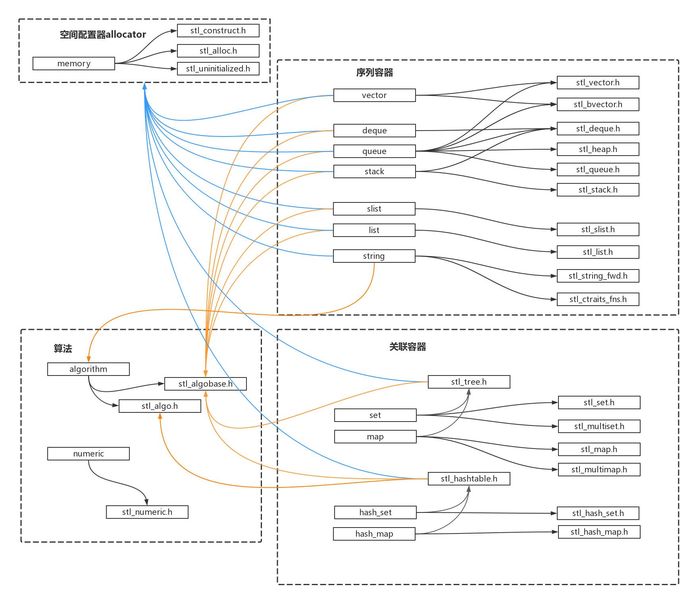

# MySTL

最近在看侯捷的《STL源码剖析》，想分享几篇心得，目的是学习C++和泛型编程。从一开始本人就没打算事无巨细面面俱到，毕竟毫无重点也不是阅读源码的好习惯。所以本人打算把重点放在空间配置器，迭代器，容器以及少量算法的实现上。这四者已能体现STL的大部分设计精髓。至于仿函数和配接器，暂不做打算。

除这篇之外，这个系列暂定写6篇，分别对应空间配置器allocator，迭代器iterator，序列容器vector，红黑树的实现，关联容器map和算法。

## 概述

### 1. 准备
C++编译器，最好是GCC
SGI STL的源码：http://www.sgi.com/tech/stl/download.html
C++基础
少量STL使用经验
少量算法和数据结构基础

### 2. STL简介
STL版本

STL是一个标准，只规定了STL的接口，内部实现没有要求。STL有许多实现版本，PJ STL（被Visual C++采用），RW STL等。

SGI STL版本注释丰富，结构清晰，可读性最强，同时它也被GCC采用，所以是最流行的版本。

注意，SGI STL并不是原封不动的被用于GCC，所以在GCC中使用STL可能会和SGI STL有一些微小的区别。

STL组件

STL分为六大组件：

容器(container)：常用数据结构，大致分为两类，序列容器，如vector，list，deque，关联容器，如set，map。在实现上，是类模板(class template)
迭代器(iterator)：一套访问容器的接口，行为类似于指针。它为不同算法提供的相对统一的容器访问方式，使得设计算法时无需关注过多关注数据。（“算法”指广义的算法，操作数据的逻辑代码都可认为是算法）
算法(algorithm)：提供一套常用的算法，如sort，search，copy，erase … 在实现上，可以认为是一种函数模板(function template)。
配置器(allocator)：为容器提供空间配置和释放，对象构造和析构的服务，也是一个class template。
仿函数(functor)：作为函数使用的对象，用于泛化算法中的操作。
配接器(adapter)：将一种容器修饰为功能不同的另一种容器，如以容器vector为基础，在其上实现stack，stack的行为也是一种容器。这就是一种配接器。除此之外，还有迭代器配接器和仿函数配接器。
### 3. STL文件概览
这是SGI STL(V3.3)的所有文件：

大约可以将文件分三类：

STL标准头文件（无文件后缀），如vector, deque, list, map, algorithm, functional ...
SGI STL内部文件（STL的真正实现），如stl_vector.h, stl_deque.h, stl_list.h, stl_map.h, stl_algo.h, stl_function.h ...
HP规范的头文件，如vector.h, deque.h, list.h, map.h, algo.h, function.h
第三类通常不推荐使用，所以我们不用考虑，可以认为它的功能与第一类文件一样（实际有区别）。

### 4. STL文件包含关系
这是部分STL文件的包含关系：

此图只为厘清STL内部的结构，图中只包含了上一小节的前两部分文件（也是部分的），即STL标准头文件（不带后缀的）和STL内部文件。

空间配置器(allocator)

图中左上角为空间配置器，通常我们可以在代码中用"#include <memory>"来包含它，它的实际实现在三个文件中：

stl_construct.h: 对象的构造和析构
stl_alloc.h: 空间的配置和释放
stl_uninitialized.h: 内存基本工具，用于提升性能
注意看所有蓝色箭头，所有的容器都直接或间接的包含了allocator，说明所有的容器都依赖allocator来管理空间。

容器(container)

图中不带后缀的文件就是标准头文件，比如vector；图中带后缀的就是标准头文件对应的实现文件，如stl_vector.h；容器vector的真正实现在stl_vector.h中。可以看到，大多数文件都有对应的关系：deque对应stl_queue.h，stack对应stl_stack ...

容器大致分为序列容器和关联容器，序列容器即逻辑上是序列化访问的容器，关联容器即通过键值对访问的容器。

你会发现，序列容器queue和序列容器stack对应了不止一个文件stl_XXX.h文件，这是因为它们是一种配接器，是基于其他容器实现的。

关联容器中，set和map，即集合与映射，set和map的底层基于红黑树实现（stl_tree.h文件），查询时间复杂度为O(log(n))，空间复杂度为O(n)。

hash_set和hash_map的底层基于哈希表实现（stl_hashtable.h文件），查询时间复杂度为O(1)，空间复杂度比set和map高。

算法(algorithm)

大多数容器或多或少包含了算法文件，这是因为许多容器内部的实现会用到一些基本算法。

通常我们用"#include <algorithm>"来使用STL内部的算法，其背后的实现在stl_algobase.h（基本算法）和stl_algo.h（其他算法）。

numeric为数值型算法。

迭代器(iterator)

你肯定会问迭代器去哪儿了。

在STL中，迭代器不是单独实现的（虽然有iterator头文件，但他只是用于实现一些特殊的迭代器），迭代器向用户和算法提供统一的数据访问方式，理应集中实现。但是各种容器千差万别，迭代器的内部实现对容器依赖较强，所以迭代器由每个容器自身包含并实现，对外开放统一的接口。

所以迭代器的实现不会存在于单独的文件中。

### 5.最后
虽然本篇没有一行代码，仅仅是对STL的概览，并建立初步认识，但是依然要求有一定的数据结构基础，C++基础和一些STL使用经验，否则在阅读之后的文章中会同时面临许多问题。
